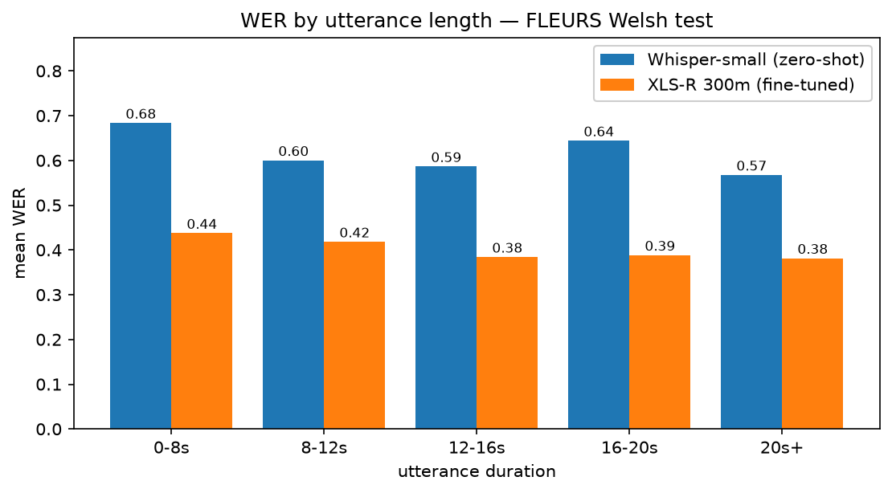
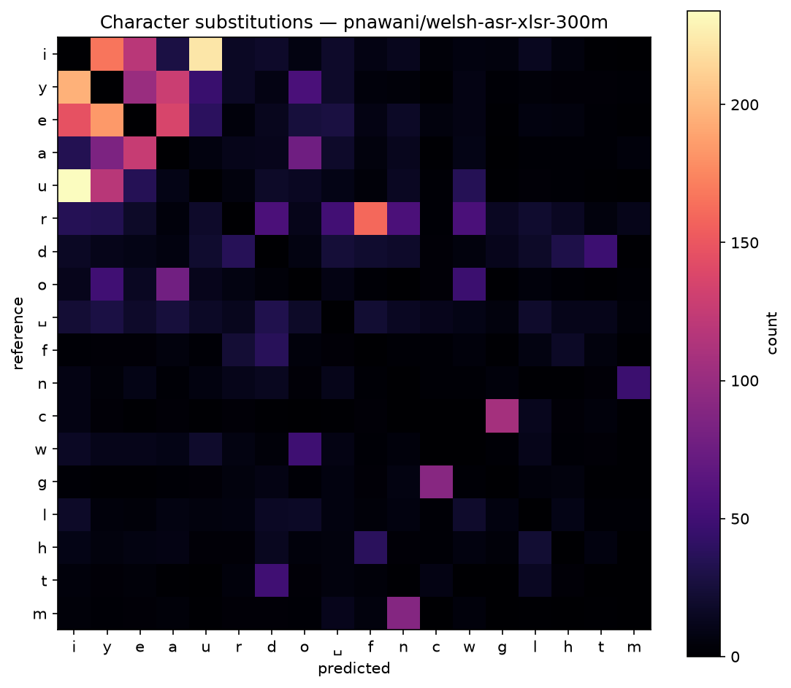

# Welsh ASR — fine-tuned XLS-R for Welsh speech recognition

[Model on the Hugging Face Hub](https://huggingface.co/pnawani/welsh-asr-xlsr-300m) ·
[Training run on W&B](https://wandb.ai/paarth-nawani-ucsd/welsh-asr)

Wav2Vec2 XLS-R (300m) fine-tuned on FLEURS Welsh, evaluated against zero-shot
Whisper-small on the same test set and through an identical normalization path.

## Results

FLEURS Welsh test, 1021 utterances.

| Model | WER ↓ | CER ↓ | WER, no digits | CER, no digits |
|---|---|---|---|---|
| Whisper-small (zero-shot) | 0.5987 | 0.2289 | 0.5853 | 0.2149 |
| **XLS-R 300m (this work)** | **0.3991** | **0.1141** | **0.3879** | **0.1098** |
| relative change | **−33.3%** | **−50.1%** | −33.7% | −48.9% |

Trained on 11.3 hours (2784 clips) for 2100 steps, roughly 12 epochs, on a free
Colab T4.

Both models are scored on identically normalized text: lowercased, apostrophes
removed, punctuation stripped, Welsh circumflex vowels kept. About a fifth of
utterances contain numerals, which a character-level CTC model cannot produce
from audio, so every figure is reported both overall and on the digit-free
subset. The two models are always scored on the same subsets.

## Error analysis

### The gain is uniform across utterance length



FLEURS Welsh utterances are long — the median is 12.7 seconds — so the usual
0-3s/3-6s/6-10s buckets would place ~90% of this test set in a single bar. Using
buckets fitted to the corpus, the fine-tuned model wins in every one, and by a
similar margin throughout. Notably neither model degrades on longer audio;
Whisper is in fact worst on the shortest clips, where there is least context.

### Fine-tuning halved the errors without changing their character



| | Whisper-small | XLS-R (fine-tuned) |
|---|---|---|
| Character substitutions | 14,032 | 6,681 (−52%) |
| Vowel-for-vowel confusions | 5,802 | 2,748 (−53%) |
| Vowel share of all substitutions | 41.3% | **41.1%** |

The most useful number here is the one that did not move. Fine-tuning cut
substitutions roughly in half, but vowel-for-vowel confusion still accounts for
the same 41% of them. Welsh `y`, `u` and `i` are acoustically close and map onto
no single English vowel; the model has become better at Welsh without the
difficulty shifting elsewhere. Consonant errors concentrate on the initial
mutation pairs (`c`/`g`, `t`/`d`, `p`/`b`), which fell by the same proportion,
817 to 387.

### Circumflex vowels are under-produced

The model emits only 57% of the circumflex vowels the references contain — 259
against 457. `â` → `a` alone accounts for 147 substitutions, the single largest
non-vowel-confusion error.

The circumflex in Welsh marks vowel length (`tan` "fire" versus `tân` "until"),
a distinction that is subtle acoustically and often recoverable only from
context. A character-level CTC model decodes each frame independently with no
language model, so it has no mechanism for that. A KenLM decoder over the CTC
output is the obvious next step and would likely recover a large part of this.

### Notable failure cases

- **WER 1.00**, 5.2s — Reference `yn union fel y maer lleuad yn tynnu ar y ddaear…` / Predicted: *empty*.
  The model emits nothing at all on 2 of 1021 clips, both unusually short (3.4s
  against a 14.2s median). Excluding them changes WER by 0.0013, so this is a
  curiosity rather than a material problem.
- **WER 0.98**, 33.1s — Reference `nid yw eu hymddygiad thermol mor sefydlog…` /
  Predicted `jdemalfhywio isnodaus difodaz laj cewzon…`. On the longest clips the
  output degenerates into orthographically Welsh-looking but meaningless strings:
  CTC is still emitting plausible character sequences with no lexical constraint.
- **WER 1.00**, 12.3s — Reference `dechreuodd diwylliannau a llwythau hynafol…` /
  Predicted `aisiant gour goers en trifus fudant…`. Same failure, and one where
  zero-shot Whisper instead produced a repetition loop, `ydych chin meddwl` eleven
  times over. The two architectures fail in characteristically different ways.

## Setup

```bash
pip install -r requirements.txt

# Whisper-small baseline
python src/evaluate.py --model openai/whisper-small --out results/whisper_baseline.json

# fine-tuned model
python src/evaluate.py --model pnawani/welsh-asr-xlsr-300m --out results/finetuned_results.json

# comparison table, plots and failure cases
python src/error_analysis.py
```

Training runs from `notebooks/train_colab.ipynb`, or directly:

```bash
python src/prepare_data.py     # character vocabulary and processor
python src/train.py --max-steps 2100 --batch-size 2 --grad-accum 8
```

## Approach

**Data.** FLEURS Welsh: 3427 train / 447 validation / 1021 test utterances,
12.2 hours of training audio. Two filters are applied before training. Clips
over 30 seconds are dropped, which costs 1.7% of the data — the 20-second cutoff
used in most XLS-R tutorials would discard 31%, because FLEURS utterances are
unusually long. More importantly, about 15% of the train split pairs a truncated
clip with its full transcript, in the worst case 0.96 seconds of audio against
303 characters. wav2vec2 downsamples by 320, so CTC cannot emit those labels at
all and returns infinite loss, which becomes NaN gradients within two steps.
Those clips are short, so removing 15% of the clips costs under 1 of 12.2 hours.

**Text.** Lowercased, apostrophes deleted (`mae'r` → `maer`), punctuation
stripped. The Welsh circumflex vowels `âêîôŵŷ` are kept; other diacritics are
folded onto their base letters, since they appear only a handful of times in
foreign names and would otherwise add vocabulary entries with almost no training
signal. The result is a 45-token character vocabulary. Both the baseline and the
fine-tuned model are scored through this same function, which is the usual
source of misleading WER comparisons.

**Model.** `facebook/wav2vec2-xls-r-300m` with a fresh CTC head, feature encoder
frozen, dropout disabled, `mask_time_prob=0.05`. Batch size 2 with gradient
accumulation 8 for an effective batch of 16, learning rate 3e-4, 200 warmup
steps, fp16.

**Constraints.** Everything except the training loop runs on CPU — the baseline,
preprocessing, evaluation and analysis — so the free Colab GPU is spent only
where it is needed. Training survived four disconnections by checkpointing to
Google Drive and resuming.

## Repo structure

```
├── src/
│   ├── data.py            # dataset loading and text normalization
│   ├── prepare_data.py    # character vocabulary and processor
│   ├── train.py           # fine-tuning
│   ├── evaluate.py        # WER/CER for any model, one code path
│   └── error_analysis.py  # comparison table, plots, failure cases
├── notebooks/
│   ├── exploration.ipynb  # dataset statistics and the baseline
│   └── train_colab.ipynb  # training on a free Colab T4
├── app/app.py             # Gradio demo
└── results/               # metrics, plots, per-utterance predictions
```

## Acknowledgments

FLEURS (Google), XLS-R (Meta AI), Hugging Face Transformers.
